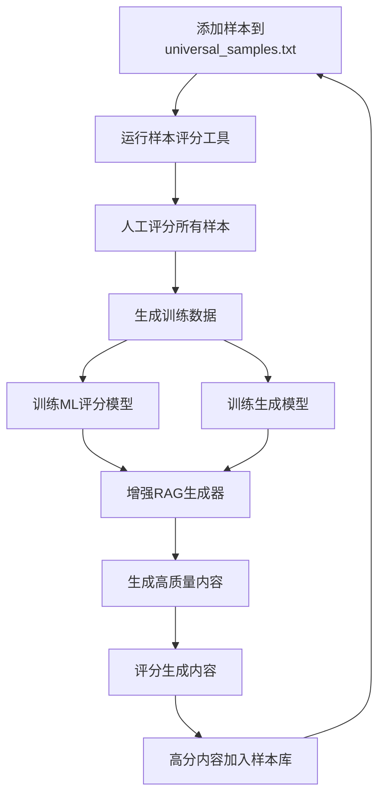

# 📚 样本集系统使用指南

## 🎯 样本集在项目中的核心作用

### 1. **RAG系统的知识库**
`universal_samples.txt` 是整个RAG（检索增强生成）系统的核心知识库：

- **存储高情绪评分文本片段**：包含各种类型的高质量内容样本
- **语义搜索基础**：通过向量化技术，能够快速找到与查询最相关的样本
- **生成指导模板**：为AI生成提供具体的写作风格和技巧参考

### 2. **生成模型的训练数据源**
- **高质量训练样本**：人工评分的高分样本直接用作生成模型的训练数据
- **风格学习**：帮助模型学习如何写出高情绪评分的内容
- **持续改进**：通过LoRA或全参数微调，让模型不断优化

### 3. **评分模型的训练基础**
- **人工标注数据**：为机器学习评分模型提供训练标签
- **特征学习**：让评分模型学会识别高质量内容的特征
- **自动化评估**：形成自动化的内容质量评估机制

### 4. **质量控制的基准**
- **评分标准**：为生成内容提供质量参考标准
- **筛选机制**：帮助识别和筛选高质量的内容
- **反馈循环**：形成持续改进的反馈机制

## 🔄 完整工作流程



## 🛠️ 使用工具

### 1. 增量样本评分工具 ⭐ (推荐)
```bash
python scripts/incremental_sample_scorer.py
```
- **智能识别新增样本**，避免重复评分
- 自动记录已评分样本的哈希值
- 只对新增样本进行人工评分
- 自动生成增量训练数据

### 2. 增量模型训练器 ⭐ (推荐)
```bash
python scripts/incremental_model_trainer.py
```
- **只使用新增数据训练模型**，避免重复训练
- 自动合并增量数据到完整训练集
- 记录训练历史，防止重复训练
- 支持LoRA和全参数微调

### 3. 增强RAG生成器
```bash
python scripts/enhanced_rag_generator_v2.py --prompt "你的生成提示" --min_score 70
```
- 基于评分优先检索高分样本
- 针对性生成高质量内容
- 支持多版本生成

### 4. 交互式评分测试
```bash
python scripts/test_scorer_interactive.py
```
- 实时测试评分模型效果
- 支持人工调整评分
- 即时重新训练模型

### 5. 传统工具 (已弃用)
```bash
# 这些工具会导致重复评分和训练，不推荐使用
python scripts/score_all_samples.py  # 会重复评分所有样本
python scripts/complete_retrain_system.py  # 会重复训练所有数据
```

## 📊 样本集的数据结构

### 原始格式 (universal_samples.txt)
```
1.武侠对决高评分样本
"拳风炸裂，两道刚猛劲力凌空相撞，气浪如涟漪般爆开！"
"重拳破空而来，却在接触瞬间如泥牛入海..."
```

### 评分后格式 (universal_samples_scored.txt)
```
## 样本 1
**标签**: 武侠对决
**评分**: 85.00
**内容**: 拳风炸裂，两道刚猛劲力凌空相撞，气浪如涟漪般爆开！
**添加时间**: 2025-01-27 10:30:00
```

## 🎯 针对性生成机制

### 高分样本优先检索
1. **评分过滤**：只选择评分≥70的样本作为参考
2. **语义匹配**：通过关键词重叠度找到最相关的样本
3. **质量保证**：确保生成内容参考的都是高质量样本

### 增强提示词构建
```
你是一个专业的小说生成器，擅长创作高情绪评分的情节内容。

## 高分样本参考 (请学习这些高评分内容的写作技巧):
### 高分样本 1 (评分: 85.0)
内容: 拳风炸裂，两道刚猛劲力凌空相撞...
特点: 这个样本在情绪渲染、情节张力方面表现优秀

## 生成要求:
1. 参考上述高分样本的写作技巧和情绪渲染方式
2. 保持情节的紧张感和吸引力
3. 目标情绪评分应达到70分以上
```

## 📈 效果提升策略

### 1. 样本质量优化
- **定期评分**：为所有样本添加准确的人工评分
- **分类管理**：按类型和评分组织样本
- **持续更新**：将生成的高分内容加入样本库

### 2. 模型训练优化
- **数据平衡**：确保各评分段都有足够的样本
- **特征工程**：优化评分模型的特征提取
- **训练策略**：根据数据量选择合适的训练方法

### 3. 生成策略优化
- **动态阈值**：根据项目需求调整最低评分阈值
- **上下文融合**：更好地结合项目背景和角色设定
- **多版本生成**：生成多个版本并选择最佳结果

## 🔧 维护建议

### 定期维护任务
1. **每周**：检查新生成内容的评分，将高分内容加入样本库
2. **每月**：重新训练评分模型，确保评分准确性
3. **每季度**：全面评估样本库质量，清理低质量样本

### 质量监控指标
- **样本覆盖率**：各类型样本的数量分布
- **评分一致性**：人工评分与模型评分的一致性
- **生成质量**：生成内容的平均评分趋势

## 🚀 快速开始

### 首次使用 (完整流程)
1. **首次评分所有样本**：
   ```bash
   python scripts/incremental_sample_scorer.py
   ```

2. **首次训练模型**：
   ```bash
   python scripts/incremental_model_trainer.py
   ```

3. **生成内容**：
   ```bash
   python scripts/enhanced_rag_generator_v2.py --prompt "你的提示" --min_score 70
   ```

4. **测试效果**：
   ```bash
   python scripts/test_scorer_interactive.py
   ```

### 日常使用 (增量流程) ⭐
当你添加新样本到 `universal_samples.txt` 后：

1. **增量评分** (只评分新增样本)：
   ```bash
   python scripts/incremental_sample_scorer.py
   ```

2. **增量训练** (只训练新增数据)：
   ```bash
   python scripts/incremental_model_trainer.py
   ```

3. **生成内容**：
   ```bash
   python scripts/enhanced_rag_generator_v2.py --prompt "你的提示" --min_score 70
   ```

## 🔄 增量系统优势

### ✅ 避免重复工作
- **智能识别**：通过哈希值自动识别已评分样本
- **增量评分**：只对新增样本进行人工评分
- **增量训练**：只使用新增数据训练模型
- **历史记录**：完整记录训练历史，防止重复

### ✅ 提高效率
- **节省时间**：避免重复评分和训练
- **资源优化**：减少不必要的计算资源消耗
- **快速迭代**：支持快速添加新样本并更新模型

### ✅ 数据一致性
- **版本控制**：通过哈希值确保数据一致性
- **状态跟踪**：完整记录每个样本的评分和训练状态
- **自动合并**：智能合并增量数据到完整数据集

通过这个增量样本集系统，你可以高效地实现高质量内容的持续生成和改进！
