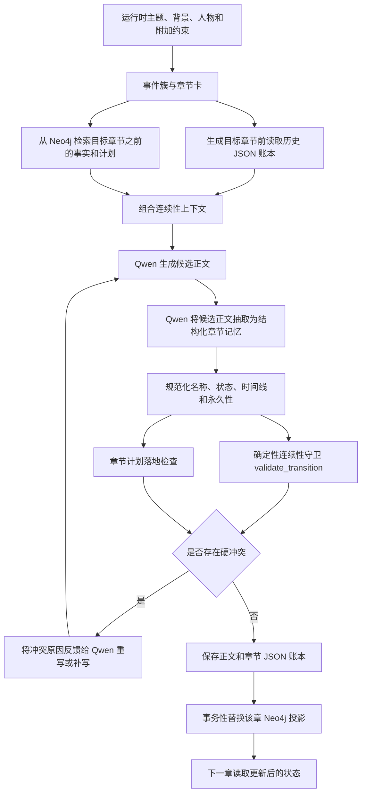
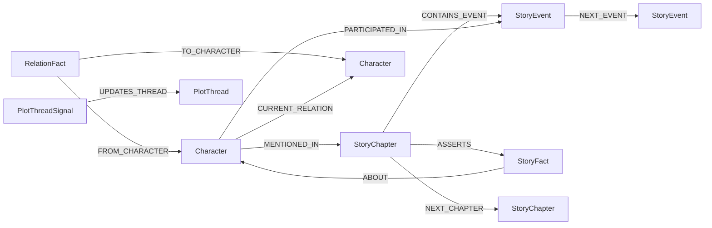

# 当前小说知识图谱：作用、工作流与连续性约束实现

本文档描述当前代码实际实现的知识图谱与 `StoryMemory` 工作流。它不是旧版设计设想，也不依赖项目中可能已经过时的说明文件。核心代码位于本目录的 `chapter_memory.py`、`story_memory.py`、`story_memory_store.py`、`online_retriever.py`，并由 `scripts/v2/generate_chapter_content_v2.py` 接入正文生成流程。

## 1. 系统定位

当前知识图谱不是一个只用于展示人物关系的数据库，而是长篇小说生成过程中的**跨章节事实记忆与连续性控制系统**。它主要解决以下问题：

1. 保存每章已经明确发生的事件、人物状态、人物关系、稳定事实和剧情线。
2. 在生成后续章节前，检索目标章节之前的有效事实并注入 Qwen 提示词。
3. 区分当前时间线、前世、回忆和梦境，避免历史状态覆盖当前状态。
4. 在候选正文生成后重新抽取事实，使用确定性规则检查它是否与前文冲突。
5. 检查章节计划要求的关键事实是否真的写入正文，而不是仅出现在大纲或提示词中。
6. 章节重写时替换旧投影、清除失效事实，避免图中同时保留互相矛盾的新旧版本。
7. 情节族生成失败时同时回滚正文、JSON 账本和 Neo4j 投影。

因此，它同时工作在两个方向：

- **生成前约束**：告诉模型哪些事实必须遵守。
- **生成后验收**：不信任模型自觉遵守，而是重新抽取候选正文并阻止冲突内容提交。

知识图谱重点保证的是**已被结构化的事实一致性**。它不能单独保证文笔、节奏、人物塑造质量，也不能绝对识别所有隐晦表达；这些边界见本文最后一节。

## 2. 总体架构



系统采用“双层记忆”而不是把 Neo4j 当作唯一数据源：

| 层 | 作用 | 是否为可恢复真源 |
| --- | --- | --- |
| 章节 JSON 账本 | 保存每章完整结构化抽取结果，按章节排序重建任意时点状态 | 是 |
| Neo4j 投影 | 提供人物、事件、事实、关系、剧情线和时间顺序的关联查询 | 否，可由 JSON 账本重建 |
| 追踪 JSONL | 记录生成前上下文、候选抽取、冲突和提交过程，便于调试 | 否 |

这种设计避免 Neo4j 暂时不可用时丢失已验收事实：JSON 账本先以临时文件加原子替换方式提交；Neo4j 连接失败时可以稍后重新同步。

## 3. 故事实例隔离

每个故事都有独立的 `story_id`。当前默认由事件簇配置内容计算 SHA-256 摘要并截取前 16 位生成，JSON 的格式差异不会改变 ID。

所有核心图节点和查询都带 `story_id`。同名角色可以同时存在于不同小说中，例如两部作品都出现“林夏”，其中一部的林夏存活，另一部的林夏死亡，两个状态不会互相污染。

默认账本目录为：

```text
<输出目录>/knowledge_graph/stories/<story_id>/chapter_memory/
  chapter_001_memory.json
  chapter_002_memory.json
  ...
```

## 4. 每章结构化记忆

`chapter_memory.py` 将正文抽取并规范化为以下字段：

| 字段 | 内容 |
| --- | --- |
| `chapter` | 来源章节号 |
| `content_hash` | 正文 SHA-256，用于判断账本是否过期 |
| `narrative_timeline` | 本章主要时间线 |
| `summary` | 本章因果摘要 |
| `characters` | 规范角色名、别名、出现模式和证据 |
| `events` | 原子事件、时间、地点、结果、参与者及因果 |
| `state_changes` | 生死、位置、健康、职业、阵营、目标、知识、持有物等变化 |
| `relationships` | 关系类型、状态、变化及证据 |
| `facts` | 可影响后文的主体-谓词-客体事实 |
| `plot_threads` | 未决、已解决或放弃的剧情线 |
| `continuity_claims` | 正文声称“本章开始前已经成立”的状态 |
| `event_preconditions` | 本章当作既成事实引用的前置事件 |
| `extraction_status` | `llm_complete`、`llm_incomplete` 或 `heuristic_incomplete` |

### 4.1 抽取原则

Qwen 抽取提示明确要求：

- 只抽取正文明确发生或明确陈述的事实，不得补写和猜测。
- 死亡必须表示为 `field=life_status, new_value=dead`。
- 昏迷、失踪和死亡是不同状态。
- 每个事件拆为原子事件，并标明参与者是实际行动还是回忆、转述、梦境。
- `old_value` 只有正文明确写出时才能填写，不能由模型自行推断。
- 死亡、出生日期、亲生血缘和真实身份可以是永久事实；权限、位置、目标、持有物等可变信息不能错误标为永久。
- 优先使用此前账本中的规范角色名，简称放入 `aliases`。

抽取最多尝试 3 次。只有同时获得人物和事件等完整结构时才标记为 `llm_complete`。部分 JSON 会标记为 `llm_incomplete`；完全失败时才产生规则抽取结果 `heuristic_incomplete`。在正式候选验收中，任何非 `llm_complete` 结果都会产生 `EXTRACTION_INCOMPLETE` 硬错误，不能进入事实账本和图数据库。

### 4.2 规范化

模型输出在校验前还要经过确定性规范化：

- 中文“死亡、去世、身亡”等统一为 `dead`。
- `dead` 自动设置 `permanent=true`，不能依赖模型是否正确填写。
- 非法枚举值会回到安全默认值。
- 重复的人物、状态、事实和关系会按稳定键去重。
- 置信度被限制在 0 到 1。
- 字段长度受到限制，避免异常输出无限进入数据库。
- 缺失的条目、空主体或无效关系会被丢弃。

## 5. 时间线模型

当前支持：

| 值 | 含义 |
| --- | --- |
| `current` | 当前主时间线 |
| `previous_life` | 前世时间线 |
| `memory` | 回忆中的历史内容 |
| `dream` | 梦境或非现实行动 |
| `mixed` | 一章混合多条时间线 |
| `unknown` | 无法明确判断，校验时谨慎视作当前线 |

人物出现模式使用：`active`、`memory`、`reported`、`dream`、`unknown`。

构建“目标章节之前的当前状态”时，只让 `current` 和 `unknown` 更新当前视图。前世、回忆和梦境中的死亡不会覆盖今生状态。例如：

- 第 1 章写前世死亡：`timeline=previous_life`。
- 第 2 章写重生后的行动：`timeline=current`。
- 第 10 章回忆第 1 章：人物模式为 `memory`，不能被判断成死者在今生活动。

章节卡角色为 `prev_life_death_only` 时，协调器会强制将该章抽取结果归入 `previous_life`，防止模型误标导致当前线污染。

## 6. Neo4j 数据模型

### 6.1 核心节点

| 节点标签 | 作用 |
| --- | --- |
| `StoryChapter` | 一个故事中的具体章节，保存章节号、摘要和正文哈希 |
| `Character` | 故事命名空间内的角色及当前派生状态 |
| `StoryEvent` | 某章明确发生的原子事件 |
| `StoryFact` | 状态变化和一般事实的历史记录 |
| `RelationFact` | 某章建立或更新的一条人物关系事实 |
| `PlotThread` | 一条剧情线或伏笔的聚合节点 |
| `PlotThreadSignal` | 某章对剧情线的开启、推进、解决或放弃记录 |
| `PlotCluster` | 尚未发生的情节族计划、目标和硬约束 |

旧版 `Event`、`CharacterState`、`Organization` 等节点仍有兼容脚本和索引，但正文在线连续性控制主要使用上表中的 `Story*` 投影。

### 6.2 主要关系



`CURRENT_RELATION` 和 `Character.life_status/current_location/...` 是从历史事实重建的快捷当前视图，不是唯一历史记录。真正可追溯的来源仍是带 `source_chapter` 的事实节点。

### 6.3 稳定 ID、约束与索引

- 角色 ID 包含 `story_id` 和规范化名称。
- 章节 ID 包含 `story_id` 和章节号。
- 事件、事实、关系和剧情线信号使用来源章节及内容生成稳定摘要 ID。
- Neo4j 对核心节点 ID 建唯一约束。
- 对故事章节查找、事实主体/谓词/章节、事件章节和时间、关系章节、剧情线状态及情节族跨度建立索引。

## 7. 生成前：如何形成约束上下文

生成第 N 章时，只读取 `source_chapter < N` 的事实，不能读取未来章节。这样在重写较早章节时不会把后文结果错误注入前文。

上下文由两部分组成：

1. **JSON 账本上下文**：从第 1 章到第 N-1 章重建最新状态、关系、剧情线和事件。
2. **Neo4j 上下文**：按 `story_id`、目标章节和本章重点人物检索最新事实、关系、未决剧情线、近期事件及当前情节族计划。

两部分合并后限长注入 Qwen 的章节梗概、节拍和正文提示。典型内容如下：

```text
【第4章生成前的连续性事实（硬约束优先）】
- [禁止违反] 马克.life_status = dead（第3章确立）；只能以回忆/梦境/转述出现
- [当前事实] 艾琳.location = 机场（第3章确立）
- [当前关系] 艾琳 --ally/trust--> 诺亚（更新于第3章）
- [未决剧情线] 失踪的原始母带（最近推进：第3章）
- [今生已发生] 第3章：诺亚确认马克死亡
- [仅历史/回忆] 第1章：马克在上一世病房死亡
```

`PlotCluster` 会明确标注为“当前情节族计划，尚未发生”，避免模型把计划中的未来事件当成已经发生的事实。

如果 Neo4j 不可用，生成器仍会使用 JSON 账本上下文；如果账本可用而图不可用，不会放弃最关键的连续性约束。

## 8. 生成后：候选正文的双重验收

候选正文不会直接成为正式章节。它首先再次交给 Qwen 做结构化抽取，然后经过两类验收。

### 8.1 与既有事实的连续性校验

`validate_transition(prior_state, candidate)` 是确定性守卫。当前所有违规均为 `hard`，出现任意一项就拒绝候选正文。

| 错误码 | 拦截内容 |
| --- | --- |
| `EXTRACTION_INCOMPLETE` | Qwen 抽取不完整或只得到规则降级结果，禁止在事实缺失时入图 |
| `DEAD_CHARACTER_ACTIVE` | 已死人物在当前线以活跃参与者身份说话、行动或参与事件 |
| `ILLEGAL_RESURRECTION` | 已死人物被无世界规则依据地恢复为 `alive` |
| `IMMUTABLE_FACT_CHANGED` | 永久状态变化被改写，例如真实身份、生父母、出生日期、死亡状态 |
| `IMMUTABLE_FACT_CONTRADICTION` | 一般事实条目与此前永久事实冲突 |
| `STATE_OLD_VALUE_MISMATCH` | 本章状态变化声称的旧值与上一章后的实际状态不符 |
| `PRIOR_STATE_CLAIM_CONFLICT` | 正文对“本章开始前状态”的陈述与账本冲突 |
| `ABRUPT_RELATIONSHIP_REVERSAL` | 敌对/决裂直接跳到信任/亲密/同盟，且没有足够变化描述和证据 |
| `CLOSED_THREAD_REOPENED` | 已解决或已放弃的剧情线被无解释地重新标为未决 |
| `TIMELINE_REGRESSION` | 当前线事件日期倒退，却没有标为回忆或前世 |
| `INTRA_CHAPTER_TIME_REVERSAL` | 同章当前线事件顺序倒退且未说明时间切换 |
| `MISSING_EVENT_PRECONDITION` | 本章把某事件当作已经发生，但此前事件账本没有对应事件 |

别名在比较前会映射到规范角色名，因此“马克”和“马克·里德”不会被当成两个不同人物来绕过死亡约束。

### 8.2 章节计划是否真正落地

只检查“与前文不冲突”还不够，因为模型可能避开必须发生的关键情节。例如章节卡要求第 3 章某人死亡，模型却只写“他可能活不过今晚”。这种正文与旧事实未必冲突，但没有完成计划。

运行时附加约束会被解析为可检查字段：

- `chapter_hard_constraints`：该章原始硬要求。
- `required_state_changes`：正文中必须明确发生并能被抽取的状态变化。
- `forbidden_active_characters`：不能在当前时间线参与行动的人物。

`_validate_chapter_memory_contract` 会检查：

1. 必须状态的角色、字段、新值、时间线和永久性是否全部匹配。
2. 禁止活动人物是否出现在 `active` 人物或当前线事件参与者中。

若计划状态缺失，系统优先让 Qwen 补写一个具有地点、触发事件、行动、现场确认者和不可逆结果的当前线场景；其他模式冲突则进行最小必要重写。修订后必须重新抽取、重新执行连续性校验和计划落地校验，不能因为是“修补内容”而绕过验收。

## 9. 拒绝、重试与提交

正文阶段的关键顺序如下：

1. Qwen 生成候选正文。
2. 执行正文格式和长度硬检查。
3. 检查与上一章结尾的滚动承接。
4. Qwen 抽取候选章节记忆。
5. 运行连续性确定性守卫。
6. 检查章节计划事实是否落地。
7. 任一步失败，将具体错误作为下一轮生成建议，最多进行当前流程设定的重试次数。
8. 只有全部硬检查通过，才保存正文并提交 JSON 账本及 Neo4j 投影。

Qwen 扩写短章节或进行局部补写后，同样必须重新走步骤 4 至 6。扩写不能悄悄改变人物生死、地点、关系或事件结局。

## 10. 章节替换与事务回滚

### 10.1 单章投影替换

`replace_chapter_memory` 在一个 Neo4j 写事务中原子替换某章投影：

1. 删除该 `story_id + source_chapter` 的旧事件、事实、关系事实和剧情线信号。
2. 删除旧的章节提及边。
3. 写入新的章节、人物、事件、事实、关系和剧情线信号。
4. 删除不再被任何章节或事实引用的孤立人物和剧情线。
5. 重新计算人物当前状态、当前关系、章节出现边界、剧情线当前状态。
6. 重建 `NEXT_CHAPTER` 和 `NEXT_EVENT` 时间边。

因此，重写第 5 章后，第 5 章旧版本中已经删除的人物死亡事实不会继续留在图中影响第 6 章。

### 10.2 情节族事务

一个情节族可能一次生成多章。开始前会快照：

- 原章节正文文件；
- 对应章节 JSON 账本；
- 生成器内存中的章节文本。

如果生成异常、硬审查失败或整个情节族未形成有效结果，则恢复快照；协调器同时恢复或删除对应 Neo4j 投影。这样不会出现“正文已回滚，但图中还保留失败候选事实”的半提交状态。

## 11. 当前状态派生规则

账本按章节升序重放，状态键为“规范人物名 + 字段/谓词”。同一键的后续有效事实覆盖早期事实，但不会删除历史事实节点。

Neo4j 当前人物视图按 `source_chapter` 倒序选择最新的当前线事实，派生：

- `life_status`
- `current_location`
- `current_health`
- `current_occupation`
- `current_affiliation`
- `current_goal`
- `status_since_chapter`
- `first_chapter` / `last_seen_chapter`

人物关系按人物对及关系类型选择最新 `RelationFact`，生成 `CURRENT_RELATION`。剧情线按最新 `PlotThreadSignal` 更新状态。

## 12. 历史回填与重新同步

续写较后章节前，`ensure_backfilled` 会扫描较早的章节正文：

- 如果缺少对应账本，则重新抽取。
- 如果 `content_hash` 与正文不一致，说明正文被修改，会重新抽取并替换旧记忆。
- 已同步且哈希一致的章节不会重复处理。

也可以独立运行同步工具：

```powershell
python -m bert_excitation_train.scripts.neo4j_kg.sync_story_memory
```

常用参数：

```powershell
# 只同步指定章节
python -m bert_excitation_train.scripts.neo4j_kg.sync_story_memory --chapters 1-5,8

# 只重建本地账本，不写 Neo4j
python -m bert_excitation_train.scripts.neo4j_kg.sync_story_memory --skip-neo4j

# 明确使用规则抽取，适合诊断，不适合作为正式完整验收
python -m bert_excitation_train.scripts.neo4j_kg.sync_story_memory --heuristic-only
```

使用 Qwen 时需要 `DASHSCOPE_API_KEY`；连接 Neo4j 需要 `NEO4J_URI`、`NEO4J_USER` 和 `NEO4J_PASSWORD`。

初始化约束与索引：

```powershell
python -m bert_excitation_train.scripts.neo4j_kg.bootstrap_neo4j
```

`--reset` 会清空整个数据库，只能用于明确需要重建的测试或开发环境。

## 13. 追踪与诊断

流水线将 `STORY_MEMORY_TRACE_FILE` 指向：

```text
<输出目录>/knowledge_graph/story_memory_trace.jsonl
```

关键事件包括：

| 事件 | 内容 |
| --- | --- |
| `ledger_context` | 目标章节生成前由 JSON 账本渲染的约束 |
| `generation_context` | JSON 账本上下文、Neo4j 上下文及最终合并结果 |
| `candidate_review` | Qwen 抽取出的候选记忆、各类数量和违规列表 |
| `commit` | 已通过验收并写入账本的章节及文件路径 |

诊断“图谱是否起作用”时，应至少检查：

1. `generation_context` 中是否出现目标历史事实。
2. `candidate_review.memory.extraction_status` 是否为 `llm_complete`。
3. 冲突候选是否返回预期错误码。
4. 通过候选提交后，Neo4j 中当前视图是否更新。
5. 重写章节后，旧事实和孤立节点是否消失。

## 14. 测试覆盖

当前测试覆盖以下关键行为：

- 死者不能在后续当前线行动，但可以出现在回忆中。
- 事件参与者的 `active/memory` 模式也受检查。
- 非法复活被拒绝。
- 前世死亡不影响重生后的当前线存活状态。
- 最新事实覆盖旧的可变状态，并被渲染为生成约束。
- 永久身份事实不能被改写。
- 当前线时间不能无标记倒退，回忆可以使用更早日期。
- 敌对关系不能无证据瞬间变为亲密。
- 正文不能依赖从未发生的前置事件。
- 简称可以解析到已经死亡的规范角色。
- 不完整 LLM 抽取不能提交。
- 章节 JSON 替换幂等。
- Neo4j 投影、在线检索、时间边和重写清理正确。
- 同名角色在不同 `story_id` 中隔离。
- 失败情节族会恢复正文和记忆。
- 运行时章节约束会成为可检查的必须状态与禁止活动人物。

运行测试：

```powershell
python -m unittest discover -s bert_excitation_train/tests -p test_*.py
```

Neo4j 集成测试需要额外设置 `NEO4J_TEST_URI`；未设置时相关测试按设计跳过。

## 15. 能保证什么，不能保证什么

### 15.1 当前能够强制保证

只要事实被完整抽取为结构化记忆，当前流程可以阻止：

- 人物死亡后在当前线重新行动或无规则复活。
- 当前线与前世、回忆、梦境互相覆盖。
- 永久身份、血缘、生日等事实被后文无解释改写。
- 位置、健康、职业和阵营变化基于错误旧值继续推演。
- 人物关系无过渡地发生极端反转。
- 已结束剧情线无解释重开。
- 当前线日期无标记倒退。
- 后文引用并不存在的历史事件。
- 章节计划要求的关键状态只存在于大纲、却没有实际写进正文。
- 章节重写后旧事实残留在图中。

### 15.2 当前不能绝对保证

1. **抽取召回率不是 100%**：非常隐晦、长距离或纯暗示性的细节可能没有被 Qwen 抽取。
2. **未建模细节无法校验**：颜色、口头禅、微小道具属性等只有进入 `facts/state_changes` 后才能成为约束。
3. **事件前提匹配是文本相似度规则**：同义改写过大时可能漏判或误判。
4. **时间解析主要支持明确年月日**：相对时间如“三周后”“次日凌晨”尚未统一换算成全局时间轴。
5. **关系反转规则覆盖有限状态集合**：更复杂的多边关系和伪装关系仍需要扩展模型。
6. **世界规则例外尚未通用建模**：当前默认死亡不可逆；若作品允许复活、分身或时间重置，需要显式加入世界规则和例外机制。
7. **知识图谱不评价文学质量**：它不负责保证文笔、节奏、情感张力、伏笔是否精彩，这些仍由其他 critic 和人工审阅负责。

因此，对“保证前后文一致”的准确表述是：**系统对成功抽取并纳入结构化账本的硬事实实施生成前提示、生成后确定性拒绝和事务提交，从流程上阻止这些事实被后续章节无声改写；尚未抽取或尚未建模的自然语言细节不在绝对保证范围内。**

## 16. 关键代码索引

| 文件 | 职责 |
| --- | --- |
| `chapter_memory.py` | 抽取协议、规范化、状态重建、连续性守卫和约束渲染 |
| `story_memory.py` | 生成流程协调、历史回填、候选审查、提交、快照与恢复 |
| `story_memory_store.py` | JSON 记忆到 Neo4j 的事务投影、当前视图和时间边重建 |
| `online_retriever.py` | 按故事和目标章节检索生成前上下文 |
| `story_identity.py` | 生成稳定 `story_id`，隔离不同作品 |
| `sync_story_memory.py` | 从既有正文回填或重建账本和图投影 |
| `bootstrap_neo4j.py` | 创建 Neo4j 唯一约束与索引 |
| `build_plot_clusters.py` | 将未来情节族计划写入图，并保持“计划”与“已发生事实”语义分离 |
| `scripts/v2/theme_constraints.py` | 把运行时章节要求解析为可验证合同 |
| `scripts/v2/generate_chapter_content_v2.py` | 将检索、Qwen 生成、抽取、校验、修订和事务提交串成完整工作流 |

